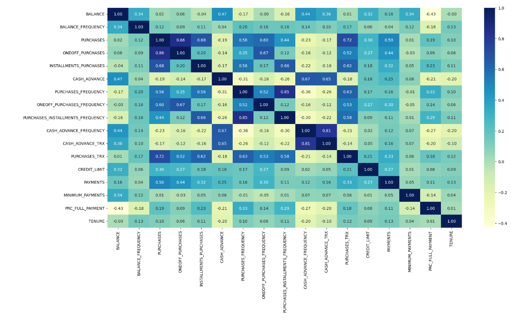

**Market Segmentation**

**1. Overview**

**Objective:**

The objective of this case is to develop customer segmentation to provide recommendations such as saving plans, loans, wealth management, etc. to target customer groups.

**Data Description:**

The sample dataset summarizes the usage behavior of approximately 9000 active credit card holders over the last 6 months. The file is at a customer level with 18 behavioral variables.

**Data:**

Use the following link to download the dataset: 

**Attribute Information:**

- **CUSTID:** Identification of Credit Card holder (Categorical)
- **BALANCE:** Balance amount left in their account to make purchases
- **BALANCEFREQUENCY:** How frequently the Balance is updated, score between 0 and 1 (1 = frequently updated, 0 = not frequently updated)
- **PURCHASES:** Amount of purchases made from account
- **ONEOFFPURCHASES:** Maximum purchase amount done in one-go
- **INSTALLMENTSPURCHASES:** Amount of purchase done in installment
- **CASHADVANCE:** Cash in advance given by the user
- **PURCHASESFREQUENCY:** How frequently the Purchases are being made, score between 0 and 1 (1 = frequently purchased, 0 = not frequently purchased)
- **ONEOFFPURCHASESFREQUENCY:** How frequently Purchases are happening in one-go (1 = frequently purchased, 0 = not frequently purchased)
- **PURCHASESINSTALLMENTSFREQUENCY:** How frequently purchases in installments are being done (1 = frequently done, 0 = not frequently done)
- **CASHADVANCEFREQUENCY:** How frequently the cash in advance being paid
- **CASHADVANCETRX:** Number of Transactions made with "Cash in Advanced"
- **PURCHASESTRX:** Numbe of purchase transactions made
- **CREDITLIMIT:** Limit of Credit Card for the user
- **PAYMENTS:** Amount of Payment done by the user
- **MINIMUM\_PAYMENTS:** Minimum amount of payments made by the user
- **PRCFULLPAYMENT:** Percent of full payment paid by the user
- **TENURE:** Tenure of the credit card service for the user

**STEPS:**
**1. Libraries used in the dataset.**

The code imports necessary libraries for data analysis and clustering, including pandas, numpy, matplotlib, seaborn, StandardScaler, PCA, and KMeans.

## **2. Exploratory Data Analysis & Data Cleaning:**
- Check the shape of the dataset.
- Check information about the data.
- Check the statistical summary of the dataframe.
- Check for Null values in the dataframe.
- Fill missing values with the mean.
- Check for duplicate entries in the dataset.
- Drop unnecessary columns.
## **3. Outlier Detection:**
- Find outliers in all columns.
- Remove outliers from columns with nearly 10% outlier.

  

## **4. Scaling the Data:**
- Scale the dataframe using StandardScaler.
## **5. Dimensionality Reduction:**
- Use PCA to convert the dataframe into a 2D dataframe for visualization.
## **6. Hyperparameter Tuning:**
- Find the optimal 'k' value using the Elbow Method.

  

## **7. Model Building:**
- Apply K-Means clustering with the optimal 'k' value.
- Visualize the clustered data using a scatter plot.

  

## **8. Analyzing Clustering Output:**
- Find cluster centers.
- Inverse transform the data to its original scale.
- Create a column as "cluster" & store the respective cluster name that they belong to.
## **9. Outcome:**
- Analyze each cluster to understand customer segments.
## **10. Save The Model:**
- Save the K-Means model.
- Save the clustered dataframe as a CSV file.

